# Fableseed Storytelling Forum

Insert Image

[View the live project here](https://fableseed-stories-03975cdde75d.herokuapp.com/)

This collaborative storytelling forum has been created as a project during my [Code Institute](https://codeinstitute.net/) Level 5 Web App Development course.

## **Table of Contents**
* [Welcome to Fableseed](#welcome-to-fableseed)
    * [Fableseed Poem](#create-your-garden---fableseed-poem)
* [Inspiration](#inspiration)
* [Fableseed Goals](#fableseed-goals)
* [User Experience (UX)](#user-experience-\(ux\))
    * [Types of Users](#types-of-users)
        * [Primary User Types](#primary-user-types)
        * [Secondary / Future Users](#secondary-/-future-users)
    * [User Stories](#user-stories)
        * [Guests](#guests)
        * [Writers](#writers)
        * [Admin](#admin)
* [Design](#design)
    * [Colour Palette](#colour-palette)
    * [Colour Accessibility](#colour-accessibility)
    * [DaisyUI Custom Theme Creator](#daisyui-custom-theme-creator)
    * [Imagery](#imagery)
    * [Typography](#typography)
    * [Wireframes](#wireframes)
    * [End product design changes](#end-product-design-changes)
* [Features](#features)
    * [Users](#users)
    * [Stories](#stories)
    * [Incentivisation System](#incentivisation-system)
    * [Responsiveness](#responsiveness)
    * [Header](#header)
    * [Footer](#footer)
    * [Animations](#animations)
    * [Nursery Page](#nursery-page)
    * [User Garden](#user-garden)
* [Security Features](#deployment-security)
    * [Authentication & User Management](#deployment-security)
    * [Access Control](#deployment-security)
    * [Permissions & Roles](#deployment-security)
    * [Environment Variables](#deployment-security)
    * [Deployment Security](#deployment-security)
* [Future Features](#future-features)
* [Models and Data Relationships](#models-and-data-relationships)
    * [Database Schema](#database-schema)
    * [Entity Relationship Diagram](#entity-relationship-diagram)
    * [Model Relationship Declaration](#model-relationship-declaration)
    * [Model Fields](#model-fields)
    * [Cardinalities](#cardinalities)
* [Testing](#testing)
    * [User Story Testing](#user-story-testing)
    * [Automated Testing](#automated-testing)
    * [The W3C Markup Validation Service](#the-w3c-markup-validation-service)
    * [The W3C CSS Validation Service](#the-w3c-css-validation-service)
    * [The JSHint Validation Service](#the-jshint-validation-service)
    * [The Code Institute Python Linter](#ci-python-linter)
    * [The WAVE Webb Accessibility Evaluation Tool](#the-wave-webb-accessibility-evaluation-tool)
    * [Chrome Lighthouse](#chrome-lighthouse)
    * [Manual Testing](#manual-testing)
    * [Unit Tests](#unit-tests)
* [Technology used](#technology-used)
* [Coding help](#coding-help)
* [Interesting Bugs](#interesting-bugs)
* [Deployment](#deployment)
* [Credits](#credits)
* [Media](#media)

## **Welcome to Fableseed**
A collaborative storytelling platform where stories grow like plants and words breathe life into a blooming world. Users plant seeds of stories (story starters), and other users add branches (replies) to grow the story. Each story “grows” like a plant, with branching paths and twists with each piece of user-generated creativity. Think mini-Wattpad meets Choose-Your-Own-Adventure — with full CRUD built in.

In Fableseed, stories are as essential as oxygen.

Plant the seeds of imagination and watch your garden blossom with vibrant flowers, each one nurtured by the tales you and others tell. These blossoms aren’t just beautiful — they cradle your stories in their petals, keeping them alive in the garden at the end of the world.

#### Fableseed Poem
The world is a desolate wasteland.  
Nothing grows here.  
Nothing thrives.

You wander through the ruin and wreckage, alone.  
Until you see a single green shoot in the decay.  
Struggling against the darkness.

You give it water.  
There is no response.  
There is no sun or warmth.

So you begin to speak.  
You tell it tall tales, fantasy fables, silly stories.  
Legends, parables, and yarns spun from nothing but hope.

The more stories you share, the taller it grows.  
The stronger it becomes.  
Until one day, it blooms.

A single, impossible flower — born of imagination.  
From it, you gather seeds.

And with them, you grow the last garden at the end of the world.

## **Inspiration**
I’m a person who likes to read and write, and who tries to come up with creative ways to get others to enjoy reading and writing, too. My passion for stories and storytelling began with books when I was a kid, but then extended into online, collaborative storytelling forums when I was a teenager. This lasted until I was almost 30, when life got super busy.

10 years later my life finally settled down a bit, but when I poked about on the net I discovered that those collaborative storytelling platforms didn’t exist anymore. All I could find were fan fiction sites - there’s nothing wrong with fan fiction sites, I just wanted to find a place where I could make my own stories and evolve them within a shared world.

So when it came time to start my 3rd project as part of Code Institute’s Level 5 in Web App Development, I had an inkling of what I wanted to create but not the confidence to plough ahead. I figured I probably needed to do something a bit more sensible this time around, something that addresses a customer need, or solves a business problem, that shows how diverse I can be across different sectors and industries.

I settled on an induction booking system for the library I work in - we were using Microsoft bookings and I thought maybe I could create something more customisable to our needs. But I sat at my computer and, instead of planning out the models for a booking system, I sat dreaming about my storytelling platform. How I could use it with my students in the Gameracy programme to get them reading, and writing stories based on small prompts. How they could use those stories and characters in their own games they were creating using [TWINE](https://twinery.org/).

To stop the madness, I plugged the project criteria into ChatGPT and asked it to make suggestions on projects based on the criteria and the short timeframe, as well as taking into account the style and inspiration behind [Lila’s Lost Words](https://nexiauk.github.io/Lila/). 

My prompt: “The task is to create something like a restaurant booking system, or a reddit style news site, as the project has to showcase CRUD capabilities but I don't want to create something that boring!”

ChatGPT immediately suggested I create a collaborative storytelling forum and that was that: Fableseed was born.

## **Fableseed Goals**
**Fableseed** is more than a web development project — it's a creative platform designed to inspire, connect, and empower users through collaborative storytelling. While it meets the technical and educational criteria of a CRUD-based web application using Django, Python, JavaScript, HTML/CSS, and SQL, its value extends far beyond the brief.

1. **Inspire Collaborative Creativity**  
    Provide a calm, imaginative space where users co-create branching stories, encouraging meaningful creative expression in a fast-paced digital world.

2. **Revive Communal Storytelling**  
    Digitally reimagine storytelling as a shared, evolving tradition — letting users plant story "seeds" and grow them together through narrative contributions.

3. **Support Mental Wellness Through Writing**  
    Offer a therapeutic outlet by encouraging reflective, low-pressure writing, helping users connect with themselves and others.

4. **Encourage Deep, Meaningful Engagement**  
    Replace vanity metrics with creative actions — every prompt, branch, and flower reflects real participation and narrative growth.

5. **Empower Aspiring Writers**  
    Lower the barrier to entry for young or beginner writers by allowing modular participation — start a story or contribute to one in progress.

6. **Design for Growth and Scalability**  
    Build a strong MVP with room to evolve — future features may include comments, visual story maps, AI prompts, and seasonal events.

7. **Deliver a Whimsical, Emotional User Experience**  
    Stand out with a unique, metaphor-rich interface that feels magical, hopeful, and emotionally resonant — more than just a functional app.

**In summary**, *Fableseed* is a technically sound, narratively rich, and emotionally engaging platform that fulfils academic requirements **while also addressing real-world needs**: creativity, collaboration, and connection in a time when those things are more vital than ever.

## **User Experience (UX)**
### *Types of Users*
#### Primary User Types
* Young or Beginner Writers - Gentle, non-judgmental space for emerging voices and playful exploration.  
* Experienced Writers - Low-pressure creative outlet for storytelling practice and experimentation.  
* Writers of All Abilities - Inclusive collaboration and community-driven creativity.  
* Casual & Social Users - People who enjoy prompts, shared writing, or cosy creativity without pressure.  
* Reflective Users - Those using writing as self-care, or drawn to the calming metaphor of growing stories.

#### Secondary / Future Users
* Educational Users - Teachers and students using Fableseed in learning environments.  
* Gamified & Puzzle-Oriented Users - Players and interactive fiction fans interested in story-unlocking mechanics.

### *User Stories*
I used a [Github Kanban Board](https://github.com/users/Nexiauk/projects/8/views/2) to track my user stories and development tasks and help keep me on track.

#### Guests
Prospective users who want to browse the forum, read some content and see if they want to join up. Guests shouldn’t be able to create content and have limited access to posted content.

As a guest:

* I want to be able to browse the forum (read-only) and view some story content to see if it’s something I want to participate in  
* I should be able to view some information on how the story forum works and what it’s about  
* I should be able to easily register for an account if I want to

#### **Writers**
Logged-in users who can create fableseeds, grow branches, and achieve rewards for doing so.

As a writer:

* I want to easily post a new Fableseed story prompt with minimal effort or complication  
* I want the ability to browse through posted Fableseeds, to decide where I want to grow some new branches  
* I want to see at a glance what type of flower I’ll gain, if I branch from a specific Fableseed prompt  
* I want the ability to grow a branch directly from a story prompt  
* I want to see the flowers I’ve earned in my user profile  
* I want to see my Fablebud balance in my user profile  
* I want to edit my own Fableseeds and Fablebranches to correct errors and spelling or grammar  
* I want to be delete my own Fableseeds and Fablebranches

#### **Admin**
* Can also participate as writers
* Also have the ability to approve/reject Fableseeds

As Admin

* I want to interact with the Fableseeds and Fablebranches in the same way as as a writer  
* I also want the additional ability to easily approve or reject Fableseeds  
* I want the ability to add new flowers in the admin interface

## **Design**
* **Flowers and literature**
[A Guide to Studying Flower Symbolism in Literature — Petal & Poem \- HK's Top Luxury Florist](https://www.petalandpoem.com/floral-thoughts/a-guide-to-studying-flower-symbolism-in-literature#:~:text=Flowers%20often%20align%20with%20overarching,the%20fleeting%20nature%20of%20life.)

Flowers and storytelling are inextricably intertwined, from the healing powers of The Secret Garden, to the whimsy of Hobbits smoking pipeweed, to the rose slowly decaying in Beauty and the Beast. Flowers and plantlife feature heavily in fiction not only as background details, but to convey emotion, as symbolism, as well as forming plot devices and connections in overarching themes.

This is why the theme of a garden and growing flowers from stories makes sense as a concept and will allow for emotive imagery and a complementary colour scheme.

* **Flowers and symbolism**
[List of plants with symbolism - Wikipedia](https://en.wikipedia.org/wiki/List_of_plants_with_symbolism)

[Floriography: The Secret Language of Flowers in the Victorian Era — Planterra Conservatory](https://planterraevents.com/blog/floriography-secret-language-flowers-victorian-era)

Various folklores, cultures and mythologies assign symbolism to plants and flowers. In Victorian times flowers were used to pass messages to friends, lovers and enemies, with extensive floral codes collated into dictionaries. Religious imagery and spiritual traditions are associated with different plants and flowers, for example the Lotus is a symbol of spiritual enlightenment and transcendence in Indian and Chinese texts.  

It was difficult to find a definitive list of flowers and their symbolism that wasn’t related to the traditionally Victorian pastime of using flowers to convey messages. Wikipedia had the most extensive list which I searched for the theme of rebirth, keeping in mind the idea that I am trying to resurrect collaborative storytelling, as well as the forum’s integral storyline of new life growing from the ashes of the old world.

Four flowers emerged from the list:

* Lotus - *an aquatic plant, doesn’t fit the imagined terrain*  
* Rainflower - *lovely, but very tiny*  
* Spider lily - *not very nice looking*  
* **Tulip - *beautiful, elegant, one of my favourite flowers***

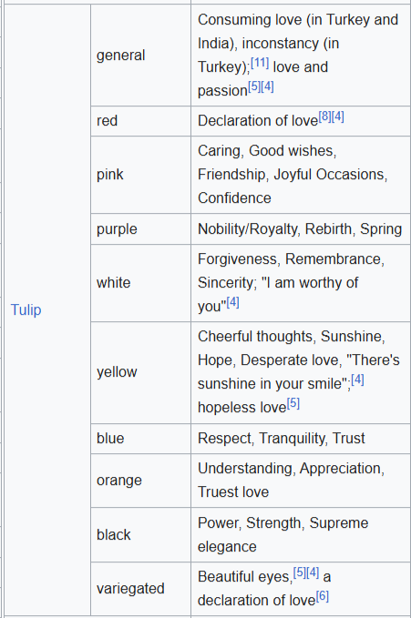

Purple tulips represent royalty and rebirth, black tulips represent power and strength. I wanted to include black because I liked the idea of the power and strength of words, as well as it being representative of the apocalyptic devastation the flowers and stories are fighting back against.

* **Black Hero tulip**, with colours ranging from a dark maroon through mahogany to midnight black.  
   
* **Black Parrot tulip** is a blackish purple tulip that is exotic and full of drama \- it looks a little less like a tulip but in a good way. It is one of the darkest tulips available.  
   
* **Queen of Night tulips are** known for their rich purple-black colour.  
   

#### **Colour Palette**

Using [Adobe Colour](https://color.adobe.com/) I plugged an image of each tulip into the [Extract Theme](https://color.adobe.com/create/image) tool and generated a palette of colours.

**Black Hero**  
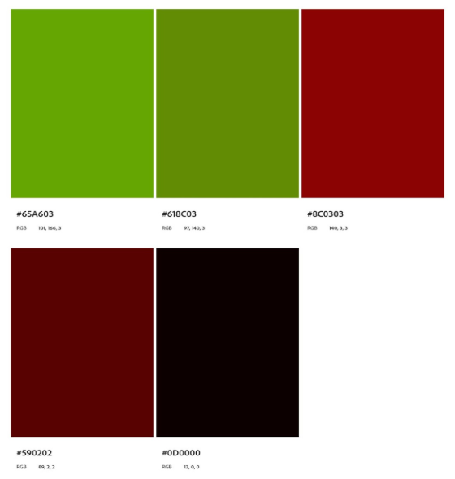 

**Black Parrot 1**  
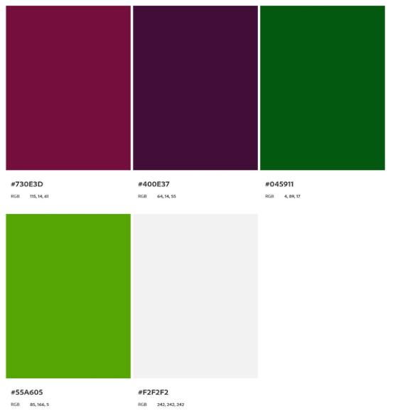 

**Queen of Night**  
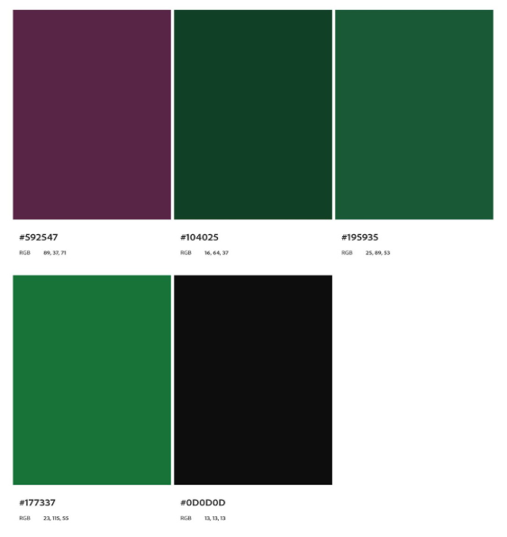 

**Black Parrot 2**  
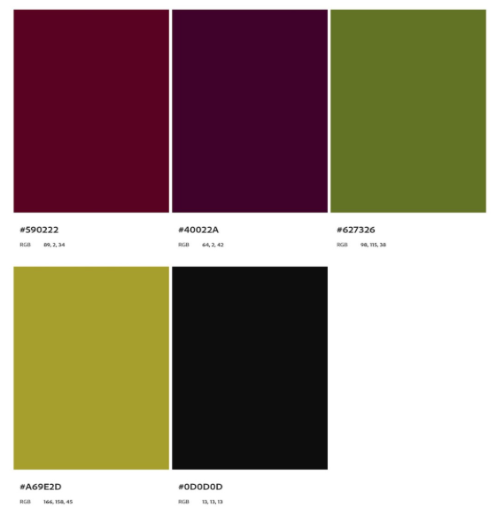 

I decided to go with **Black Parrot 1** for its balanced mix of greens and purples, with a lighter colour suitable for text. I also took Woodsmoke (almost black) from **Black Parrot 2.**

[Colorkit](https://colorkit.co/color/6830c1/) was used to find the closest matching Tailwind colours.

  
**Claret:** #730E3D  
**RGB:** 115, 14, 61  
**Closest Tailwind Colour:** pink-900  
**oklch(0.3683 0.1374 359.46)**

  
**Eggplant:** #400E37  
**RGB:** 64, 14, 55  
**Closest Tailwind Colour:** brown-900  
oklch(0.15 0.25 336.06)

  
**Black Smoke:** #0D0D0D  
**RGB:** 13, 13, 13  
**Closest Tailwind Colour:** Black  
oklch(0.1591 0 0)

  
**Deep Green:** #045911  
**RGB:** 4, 89, 17  
**Closest Tailwind Colour:**   
green-900  
oklch(0.4037 0.1274 144.22)

  
**Leafy Green:** #55A605  
**RGB:** 85,166, 5   
**Closest Tailwind Colour:** light-green-800  
oklch(0.6477 0.1888 135.3)

  
**White Smoke:** #F2F2F2  
**RGB:** 242, 242, 242  
**Closest Tailwind Colour:** grey-100  
oklch(0.9612 0 0)

#### **Colour Accessibility**
According to [Adobe colour’s accessibility](https://color.adobe.com/create/color-accessibility) tool, the Black Parrot theme was colour blind safe. 

[Adobe’s colour contract checker](https://color.adobe.com/create/color-contrast-analyzer) showed the following colour pairings to be accessible:

* **#730E3D** and #F2F2F2  
* **#0D0D0D** and #F2F2F2  
* **#045911** and #F2F2F2  
* **#400E37** and #F2F2F2  
* **#55A605** and **0D0D0D**  
* **#55A605** AND **#400E37**  
* **#55A605** and **#730E3D** - only for font 18pt and above and actionable icons and graphics

The colour scheme gave me a wide variety of pairings to work with, allowing versatility within Fableseed.

#### DaisyUI Custom Theme Creator
I decided to add the [Daisy UI](https://daisyui.com/) Tailwind plugin to my build as it provides useful component class names to help with writing less code and building faster. The [DaisyUI theme generator](https://daisyui.com/theme-generator/?lang=en) generates CSS from preset themes to add to your main Tailwind import css file, but you can also use it to generate your own custom colour scheme and it will even show whether your foreground and background colours are WCAG AAA compatible. Below are screenshots of my theme in the generator:

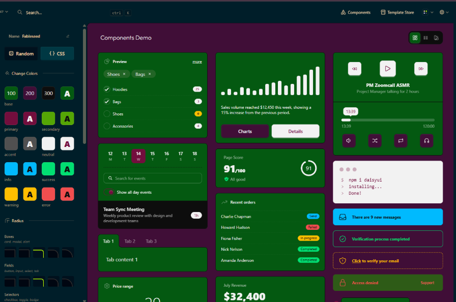
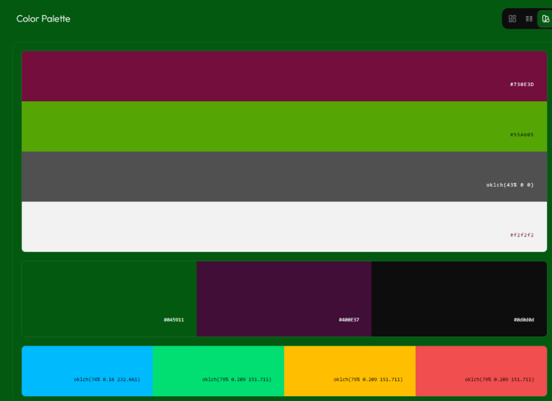

#### **Imagery**
I searched the internet with a clear image in mind of a flower growing from a post-apocalyptic city. My first inspiration came from this photo from an article about flowers that grow after wildfires. - [see credits section](#credits)


My second inspiration came from this image of a small shoot growing out of a cracked city street. - [see credits section](#credits)


I found this image of a tulip that I wanted to use as the basis for my hero image - [see credits section](#credits)


I used [Adobe Firefly](https://www.adobe.com/products/firefly.html) to generate a scene of a tulip growing out of a devastated cityscape, using this particular tulip as a composition reference.

**Prompt:** “A black-purple tulip growing out of the ashes of a fallen, post apocalyptic city. The sky is darkened and the earth is devastated. The background is slightly out of focus and the tulip is highlighted in a slightly vibrant glow. The tulip has lots of luscious green leaves”

I used one of the generated images to create a portrait and a landscape hero image.

* Portrait Hero Image  


* Landscape Hero Image  


* Edited version for responsive styling  


I used [Adobe Photoshop](https://www.adobe.com/uk/products/photoshop.html) to grab the tulip by itself to plug back into Firefly so I could create a logo out of it using the following prompt and settings:

**Prompt:** “Purple-black tulip growing from the pages of a book”

**Settings:** Square, Flat Design, Vector Look, Bold Lines, Line Drawing, Bioluminescent, Vibrant Colours, Backlighting.

* Generated Image:


I used Photoshop again to crop and re-colour the design to match Fableseed’s colour palette, using masking techniques and the re-colour tool.

* Logo image:


The images for the different flower types were created in Canva using flowers of a similar art style. Where a matching flower image didn’t exist, I created one and ended up with 12 images I was very happy with.


#### Typography {#typography}
I used two sites to search for fonts and compare them against each other:

[https://fontjoy.com/](https://fontjoy.com/)

[https://fonts.google.com/](https://fonts.google.com/)

The set I came up with is listed below:

* **Great Vibes** for the logo/site main header  
* **Merriweather Sans** for sub-headings  
* **Inclusive Sans** for body text

Great Vibes is high contrast vs Merriweather Sans and Inclusive Sans \- this was a purposeful choice as high contrast typography pairing can be used to improve readability, establish visual hierarchy, and create interest.

*  **Great Vibes**
I wanted a flowing, plantlike script for Fableseed’s main title/logo font, however it also needed to be legible and readable. Lots of flowing and calligraphy fonts have partial letters (the top of an ‘S’ missing) or badly formed letters (‘e’ sometimes looks like ‘a’) or even added flicks and flourishes that make a capital ‘F’ look like a weirdly-shaped capital ‘E’.

I fell in love with the font called Fondamento, but couldn’t get over how the capital ‘F’ looked:


The Great Vibes font is nicely formed and easy to read at a larger font size. It only has one style, which isn’t a problem as I only want to use it exactly as it is and for only two words \- ‘Fableseed’ and ‘Garden’.


* **Merriweather Sans**
A sans-serif font known for its readability on screens, particularly at smaller sizes, and its traditional feel. With italics applied, double storey letters become single storey letters, ideal for people with specific learning difficulties. It’s traditional in style, despite the modern shapes it has adopted.

* **Inclusive Sans**
A text font designed for accessibility and readability. It fits cohesively with Merriweather as they are both San-serif, so it also contrasts well with the title/logo font, Great Vibes.

I’d also looked at Raleway as a choice for the sub-headings, as it also changes double storey letters into single storey with italics applied. So, I had a chat with ChatGPT about the suitability and feel of the scheme with each sub-heading font applied.

ChatGPT gave me some useful insights, which can be found at this link: [ChatGPT Font discussion](https://chatgpt.com/share/686a52b0-61a4-8005-9e36-e24e77b2c71d). It also produced code to use in [CodePen](https://codepen.io/Nexiauk/pen/JodgNvy), allowing me to look at both options together. This is ultimately what helped me to decide on Merriweather vs Raleway. It simply looked nicer.

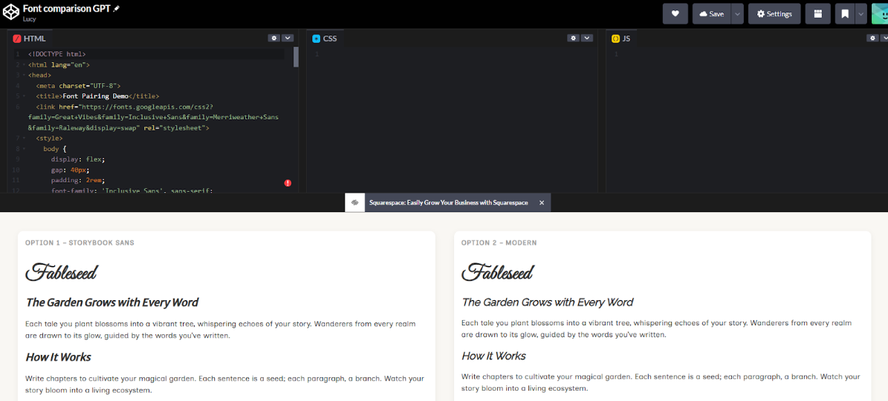

#### **Wireframes**
I was inspired by collaborative storytelling platforms that I used to frequent on Proboards and FreeForums. [Here is a link to Event Horizon,](https://eventhorizon.freeforums.net/) a site I created myself more than 10 years ago. I wanted to keep the same sort of boxy, table-style vibe that freeforums and proboards have as a sort of homage, as well as it being a neat way to display many Fableseeds and their content.


I started by creating my wireframes on a Canva whiteboard just so I could be as messy as I liked and move things about. I then transferred these into a [Canva website mockup](https://www.canva.com/design/DAGyZh0LIn0/oZaWEPu1ycptgKwQmzO8Mw/view?utm_content=DAGyZh0LIn0&utm_campaign=designshare&utm_medium=link2&utm_source=uniquelinks&utlId=h3a80639be5) for mobile and desktop.

#### End product design changes
I think my end product is very representative of my original wireframe design. I had a very clear image of the vibrant colour scheme I wanted to use and the style of site I wanted to create. The Fableseed list is purposefully a table rather than something more modern, like cards, as a nostalgic throwback, although I hope my table is better looking and prettier than the original Proboards ones.

The only significant change to the end product was the background image that I overlaid my background colour with. It just felt like it was missing a pretty *something* and that something turned out to be flowers - which is part of Fableseed's core mechanics. I found a frame I liked in Canva, made it transparent, 'glued' several iterations of the frame together and rotated it to sit nicely on desktop. I've purposefully chosen to hide it on mobile to leave the design uncluttered on smaller screens. It's also layered over a different coloured-background on index.html, but that darker background was part of the original design as a striking entry into the site.

I also decided that I wanted to explore GSAP animations. It's something I wanted to do in my last project and didn't get a chance, so I introduced SplitText and Scrolltrigger for a slowly unfolding storybook feel on the homepage. The only issue I have with this is that GSAP automatically applies aria hidden to the elements and aria hidden shouldn't be paired with paragraphs, so this gives errors for accessibility. I tried changing to divs instead but the layout was silly and still produced the errors, probably because lighthouse has decided that the aria-hidden is unnecessary or prohibitive to screen-readers, even though the aria-hidden is removed as the elements appear.

## **Features**
### *Users*
* Register/login/logout
* User profile: “My Garden” showing stories planted or contributed to  
  * Display Name, Profile picture, Bio  
  * Edit profile, which allows an image change by the user.

### *Stories*
* Users create a **Story Seed** (title + intro)
* Story seeds approved by admin
* Others can contribute **Branches** (replies on seed threads)

### *Incentivisation System*
* Each branch posted on a a Fableseed with a previously uncollected flower, grants that flower to the user's garden
* Flower quantity increases by +1 with each branch posted
* +1 Fablebud granted to the user's profile
* Fablebud spend to post branches - ***not currently implemented.***

### *Responsiveness*
Fableseed has been built mobile-first and is responsive on screen sizes from 320px through to 2560px. Tailwind breakpoints have been applied to classes across many different elements to ensure that they look good, are legible, and resize nicely. 
* I did a lot of experimentation with trying to get the background overlay image looking nice.
* The navigation menu collapses on mobile and tablet and opens via a burger icon.
* The nursery table hides all of the columns aside from Flower and title on mobile, which is all you really need to get going on Fableseed, especially as the author and created info is on the fableseed view.
* Fableseeds and Fablebranches have a stacked internal layout on mobile, inclusive of the Tend and Prune buttons.
* My Garden also stacks the profile area on mobile and implements flex on the Earned flowers section.
* The timeline on the About page alternates steps from left to right on tablets and up, but on mobile it all sits on the same side to make full use of the smaller space.
* Crispy Forms has been used and allowed to handle form responsiveness across devices. I have used the Crispy form helper layout in forms.py to apply additional styling

### *Header*
The header contains the Fableseed logo and title, along with navlinks that display as a horizontal list on large screens and above, and a collapsed dropdown list on mobiles and tablets. The nav links have hover and active states, where the colour changes, and they resize nicely across all screen sizes. The Fableseed title is clickable and navigates users back to the homepage at all times.  The logo is purely for decoration and branding.


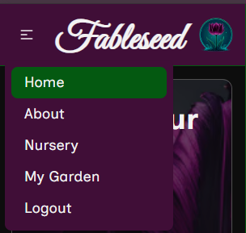

### *Footer*
The footer contains information on the user's current login status. It will show who you are currently logged in as, or that you are currently logged out.


### *Animations*
I have introduced [GSAP](https://gsap.com/) animations on the home page, to give the opening poem the effect of text unfolding a line at a time. There is a fallback in place in case the JavaScript fails, that the whole poem will still display, as its the main hero text. This particular effect was constructed using a GSAP timeline that uses SplitText and Scrolltrigger, with the poem parts initially being set to hidden and the JS revealing it as the timeline progresses.

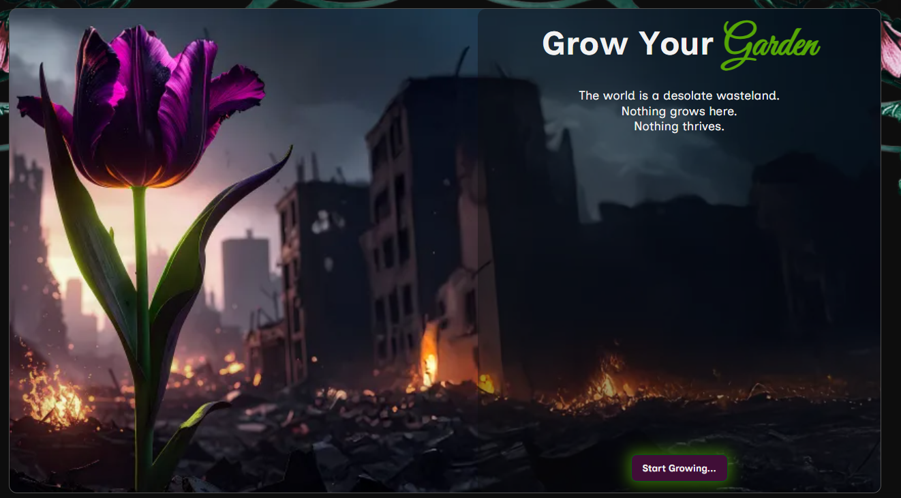
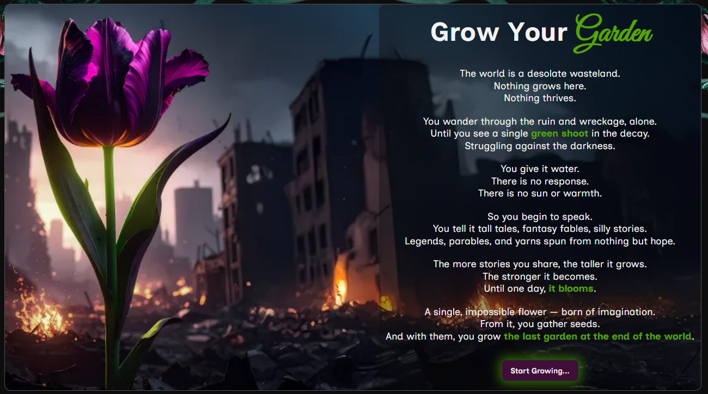

### *Nursery Page*
The nursery page is formatted in a table, which shows Fableseed posts approved by admin. It includes headers for: Seed Title, Author, Date Created, and Last Edited, which references the last time a branch was created on that seed post. The rows highlight on hover using JavaScript, and the whole row is clickable for opening up the fableseed-view.
The table also includes a column that shows an image of the flower type associated with that seed. Logged-in users can create a new Fableseed by clicking on the Plant a Seed button, which will open the cultive form. The plant a seed button has inverting glow and shadow effects.

The nursery table includes pagination functionality so that the table doesn't grow huge and unwieldy. Truncation also exists on the Seed title column so that as the screen size changes, long titles don't affect the layout adversely.

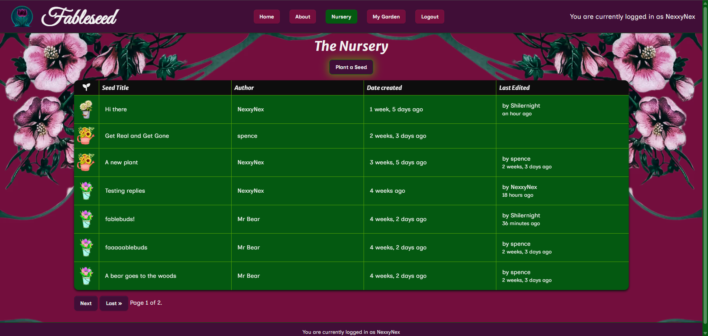  
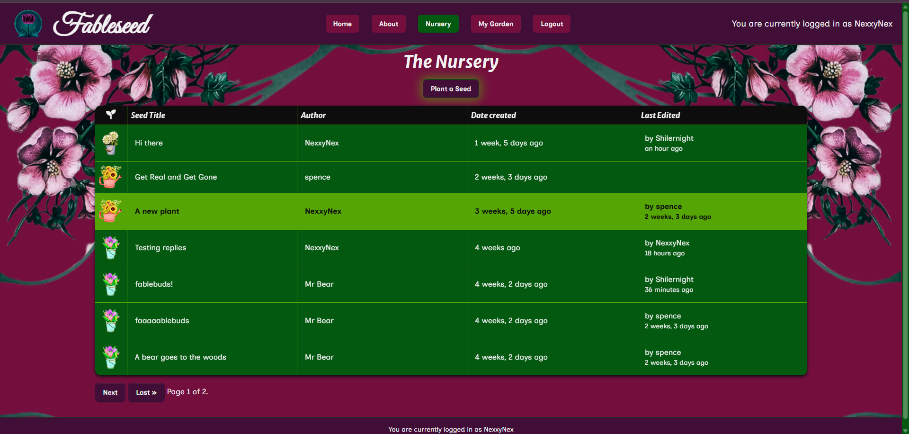  

  
  
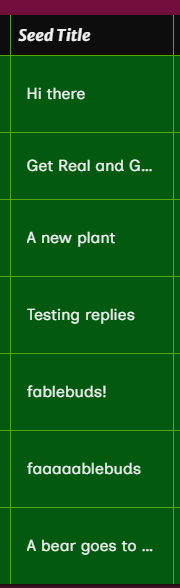

### *Fableseeds and Fablebranches*
Fableseeds are planted from the nursery view - pressing the Plant a Seed button generates the cultivate form. The cultivate form is used for both Fableseeds and Fablebranches, and will update the title on the field accordingly as well as picking up the appropriate form in the background.

After posting a Fableseed, a helpful message is shown in green with a theme-appropriate message.

The title of the Fableseed-view is taken directly from the Fableseed title written by the user and displays an inline image of the flower they chose to associate with it, giving potential branchers an indicative clue of what flower they will receive. When there are no branches, a conditional message is shown encouraging the logged-in user to be the first to reply. The Grow a Branch button is at the bottom of the screen because users should always read through the story thread before replying. It has inverted shadow and glow effects on hover, the same as Plant a Fableseed.

The logged-in user who created the Fableseed can Tend(edit) or Prune(delete) as needed. However, once a branch exists, seeds can no longer be pruned to retain story integrity.

After posting a Fablebranch, a helpful message will appear in green with a theme-appropriate message that automatically picks up what type of flower you have grown in your garden.
The logged-in user who created the Fablebranch can Tend/Prune as desired - if they prune, the quantity of that flower will decrease in the user's garden, once the quantity reaches 0, the flower will disappear completely.

Pruning generates a modal that makes sure you want to carry out the intended action. Once confirmed, a message informs the user that a pruning action has taken place and they are returned to the nursery table.

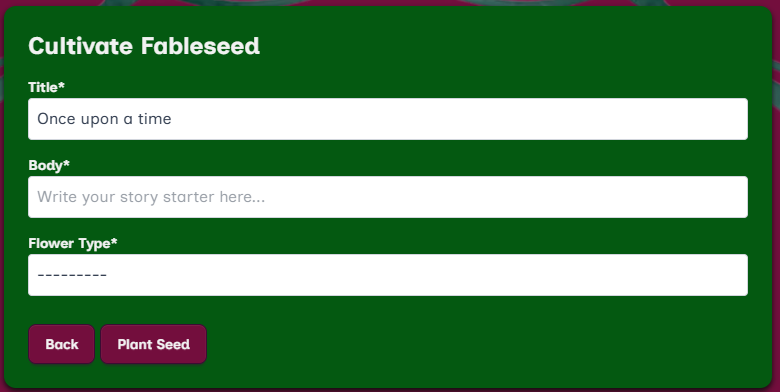
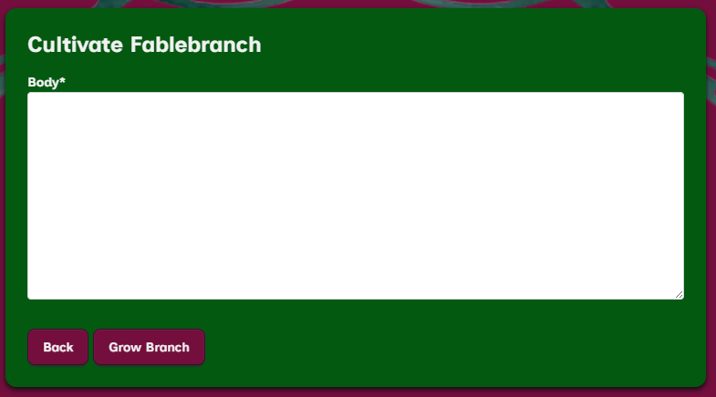
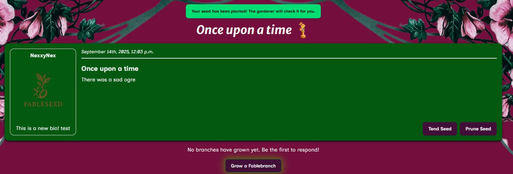 


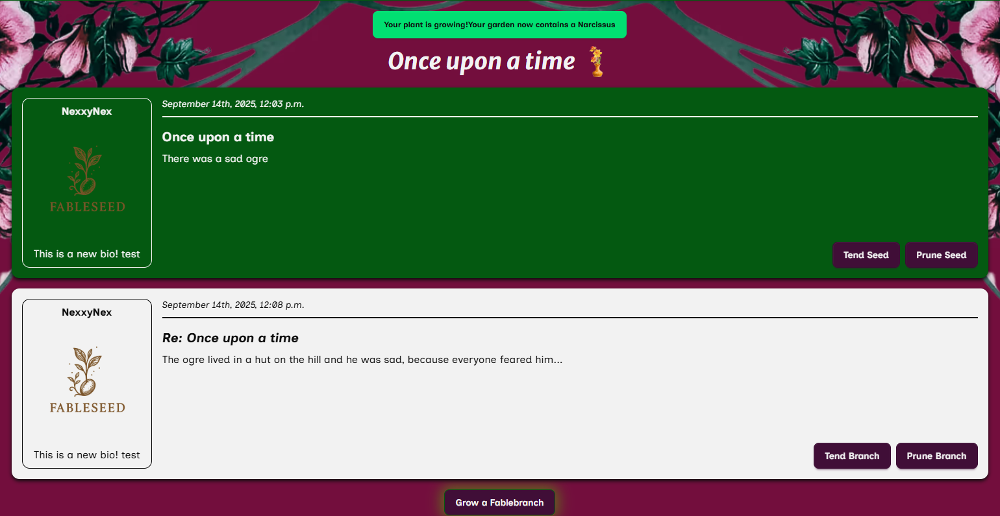
 
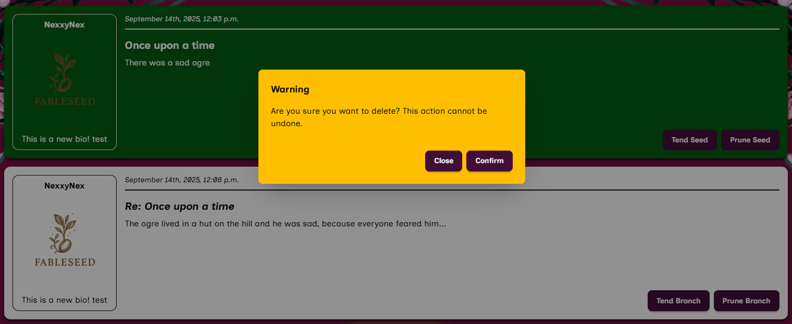 
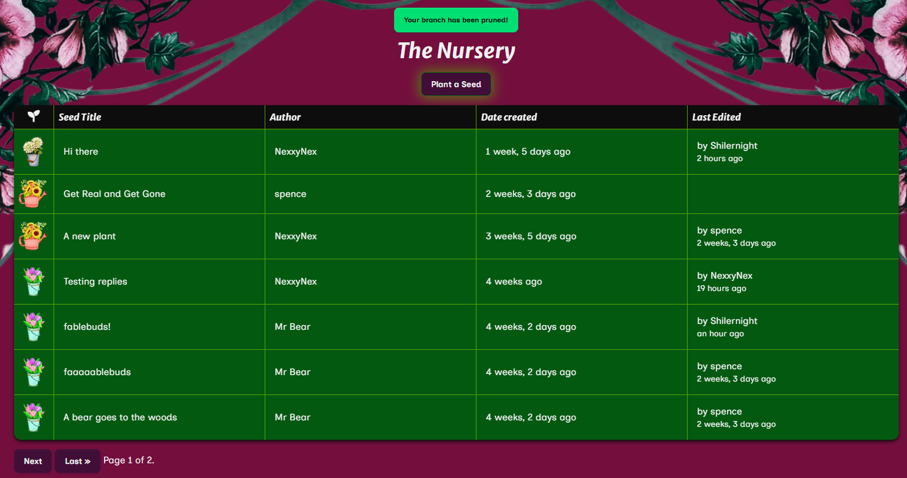 


### *User Garden*
The user garden populates automatically with the logged-in user's detail in the heading, as well as forming part of the page's title. It shows the display name, a bio tagline, the user's email address if they entered it (optional), their full name as entered, and their fablebud count. They can edit their profile and change the display name, bio and profile picture via the edit-profile form. The description list stacks on mobile phones to make best use of the space.

The earned flowers area collects all flowers earned from branching a flower associated with a fableseed for the first time. The quantity of the flower increases as more branches are written on seeds of that same flower type.

The flower images have a hover effect, showing they are clickable - they link back to the fableseed that the user first branched of that flower type.

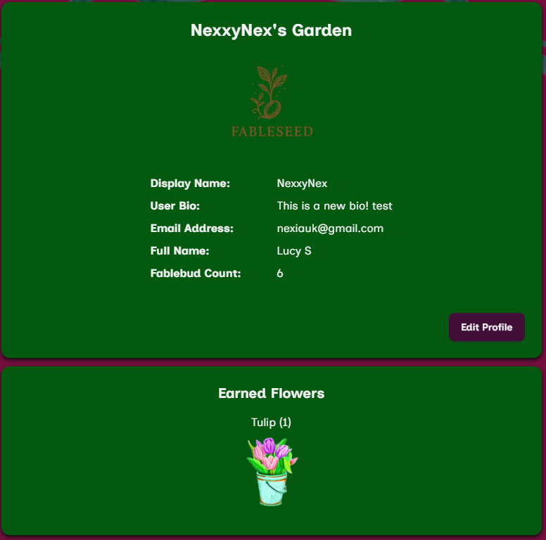
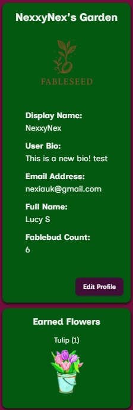  
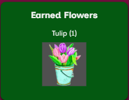

### *About Page*
The about page features a timeline of steps that feature in the Fableseed Gardener's Manual. It includes font awesome icons of seedlings and is contained in a scrollbox so that the socials bar can be kept always visible on larger screen sizes.

The timeline alternates from left to right from tablet size up. On mobiles the timeline items stack on top of each other on the right of the bar and seedlings to make best use of the space.

The socials bar features links to active profiles and have a nice hover effect. The links open in a new tab.

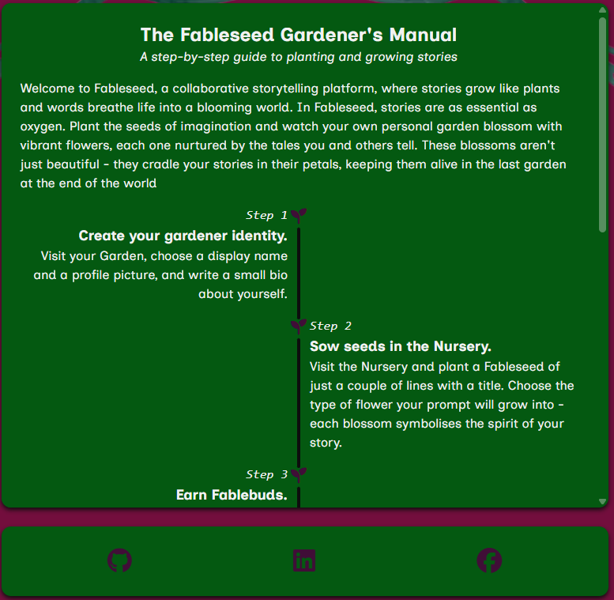
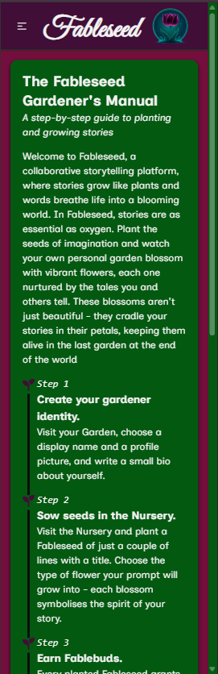


##  **Security Features**
### *Authentication & User Management*
* Django Allauth is used to handle user registration, login, logout, and account management.  
* Provides built-in security features such as password hashing, email verification, and session handling.  
* Ensures only authenticated users can create and manage their own Fableseeds, FableBranches, and Profiles.  
* Guests have read-only access and cannot create, edit, or delete records.

### *Access Control*
* Actions such as creating, editing, and deleting Fableseeds and FableBranches, and editing Profiles, are protected with @login_required on Django views.  
* Buttons and UI elements for these actions are only rendered for authenticated users (if user.is_authenticated).  
* Guests cannot perform restricted actions even if they try to access the URLs directly.  
* This ensures proper access control and prevents unauthorized modifications.


### *Permissions & Roles*
Users:
*  Can create, edit, and delete their own Fableseeds and FableBranches, and edit their own Profiles (cannot delete them).
* Seeds with existing Branches cannot be deleted by regular users, protecting relational integrity.

Admins:
* Can create, edit, and delete any Fableseed or FableBranch.  
* Can create, edit, and delete Flowers and manage user Flowers.  
* Can approve Seeds and delete users.

Guests: 
* Can view content but cannot create, edit, or delete.  

### *Environment Variables*
* Sensitive data is stored securely in an env.py file, which is hidden via .gitignore.  
* Keys and settings stored in env.py include:  
    * SECRET_KEY (Django project key)  
    * DATABASE_URL (PostgreSQL database connection)  
    * CLOUDINARY_URL (media storage)  
* .venv (virtual environment) is also excluded from GitHub, ensuring no dependencies or system files are exposed.
* This sensitive configuration is stored in config vars in Heroku

### *Deployment Security*
* DEBUG mode is disabled in production.  
* No passwords, API keys, or sensitive information are ever committed to the repository.  
* All environment-specific settings are managed securely via env.py.

## **Future Features**
* Fully working Fablebud economy system
* Full history list of Fableseeds and Fablebranches on the user profile
* Filter by: most grown stories, newest seeds, flowers
* Search by: specific flowers
* Visual story tree (JS or D3.js)
* Word count goals per chapter (live JS tracker)
* “Garden Stats” page: most popular authors/stories
* ‘Like’ system grants additional flowers of that type
* Seasonal events
* WYSIWYG text editor for colours, fonts and effects


Each flower icon in profile gardens could:
* **Bloom open on hover** with a tooltip (“Luna Lily: Symbol of quiet magic”)
* **Link to a filtered view** of authored branches for that flower type
* Visually change as you collect more (e.g. 1–3 is a bud, 4–7 is a full bloom, 8 \+ is a golden sparkle version)
* A sample **JavaScript animation** to make flowers bloom on like

## **Models and Data Relationships**
### *Entity Relationship Diagram*
This Entity Relationship Diagram for Fableseed was created using [Mermaid](https://mermaid.js.org/)’s built-in ERD diagramming tool. [ChatGPT](https://openai.com/index/chatgpt/) was used to help me understand the syntax and symbols used, as well as to double check my logic.


### *Overview*
This section contains the Django models for the **Fableseed** application, a storytelling platform where users create story seeds, branch stories, and earn flower rewards.  

**Models included:**
- **Fableseed**: Story seeds created by users.  
- **Flower**: Flowers associated with seeds and rewards.  
- **FableBranch**: Branching replies to seeds.  
- **UserProfile**: Extended user information for display purposes.  
- **UserFlower**: Tracks flowers earned by users from seeds and branches.  

The project uses Django’s built-in `User` model extended via a `UserProfile`.

### *Model Relationships (ERD Notation)*

**USER ||--|| USER_PROFILE : "has profile"**  
Each user has exactly one profile.  
USER_PROFILE stores extended info like display name, picture, and bio, while the base USER holds login credentials and name.

---

**USER ||--|{ FABLESEED : "writes"**  
 One user can write many Fableseeds.  
 Think of a Fableseed as a story idea or starter. A user might create several of them.

---

**USER ||--|{ FABLE_BRANCH : "writes"**  
 One user can write many Fable Branches.  
Each branch is a continuation of a story. A user can write different branches for different stories.

---

**FABLESEED ||--|{ FABLE_BRANCH : "has branches"**  
One Fableseed can grow into many branches.  
Each seed can sprout multiple paths (storylines), like chapters or what-if versions of a story.

---

**FABLESEED |{--|| FLOWER : "assigned flower"**  
 Every Fableseed must be assigned exactly one flower type.  
 This flower is the "reward type" for the story seed. Different seeds may share the same flower type.

---

**USER ||--|{ USER_FLOWER : "earns"**  
 Each user can earn many flowers.  
 Flowers represent rewards or achievements tied to that user.

---

**FLOWER ||--|{ USER_FLOWER : "is earned as"**  
 Each flower type can be earned by many users.  
 For example, a tulip might be earned by multiple users, tracked through a USER\_FLOWER record.

---

**FABLE_BRANCH ||--|{ USER_FLOWER : "earns flower"**  
A branch can reward one flower type, but multiple users can earn it, with quantity tracked per user.

 ---
**Explanation:**
- Each **user** has exactly **one profile**  
- A **user** can write many **Fableseeds** and **FableBranches**.  
- Each **Fableseed** can grow into multiple **FableBranches**.  
- Each **Fableseed** is assigned exactly **one flower type**, shared across seeds.  
- Users can earn multiple flowers as rewards.  
- Each **Flower** type can be earned by many users.  
- A **FableBranch** can earn exactly **one flower type**, but the quantity can be increased by further branches of the same flower type.  

### *Model Fields*

**USER**
| Field | Type | Notes |
|-------|------|------|
| id | int PK | Primary key |
| username | CharField | Unique login name |
| email | EmailField | Validated email |
| password | CharField | Password hash |
---
**USER_PROFILE**
| Field | Type | Notes |
|-------|------|------|
| id | int PK | Primary key |
| user| int FK | One-to-one link to `USER` (CASCADE) |
| display_name | CharField | Name displayed in the app |
| profile_picture | CloudinaryField | User avatar |
| bio | TextField | Short biography |
| fablebuds_count | PositiveIntegerField | User’s reward points |
---
**FABLESEED**
| Field | Type | Notes |
|-------|------|------|
| seed | AutoField PK | Primary key |
| flower_type | FK | References `FLOWER` (PROTECT) |
| title | CharField | Story seed title |
| body | CharField | Story prompt |
| approval_status | BooleanField | Pending or Approved |
| created_on | DateTimeField | Auto timestamp |
| edited_on | DateTimeField | Auto timestamp |
| author | FK | References `USER` (SET_NULL) |
| fablebuds_earnt | PositiveIntegerField | Reward points earned by seed |
---
**FABLE_BRANCH**
| Field | Type | Notes |
|-------|------|------|
| branch | AutoField PK | Primary key |
| seed | FK | References `FABLESEED` (PROTECT) |
| body | TextField | Story content |
| created_on | DateTimeField | Auto timestamp |
| edited_on | DateTimeField | Auto timestamp |
| author | FK | References `USER` (SET_NULL) |
| fablebuds_cost | PositiveIntegerField | **Deprecated** — now determined by flower type |
---
**FLOWER**
| Field | Type | Notes |
|-------|------|------|
| flower | AutoField PK | Primary key |
| flower_name | CharField | Name of the flower |
| flower_image | CloudinaryField | Image of the flower |
| fablebuds_cost | PositiveIntegerField | Cost of the flower in fablebuds |
---
**USER_FLOWER**
| Field | Type | Notes |
|-------|------|------|
| id | AutoField PK | Primary key |
| user | FK | References `USER` (CASCADE)|
| flower | FK | References `FLOWER` (PROTECT) |
| quantity | PositiveIntegerField | Number of this flower earned by the user |
| earned_from_seed | FK | References `FABLESEED` (CASCADE) |
| earned_from_branch | FK | References `FABLE_BRANCH` (SET_NULL) |
| earned_on | DateTimeField | Timestamp of earning |
---

### *Design Notes*

- **User model**: Used Django’s built-in `User` model extended via `UserProfile` for extra fields.  
- **Author deletion**: Seeds and branches remain if a user deletes their account. The author is displayed as **“Deleted User”**.  
- **Flower cost**: The `fablebuds_cost` field in `FABLE_BRANCH` was removed; cost is now determined by the associated flower to ensure consistency and scalability.  
- **FableBranch rewards**: Each branch earns **one flower type**, but multiple users can earn it. Quantity is stored in `USER_FLOWER`.  

I ended up using Django’s built-in user model and extending it with a user profile model with extra fields. This was purely by accident as at the time I didn’t know you couldn’t extend the user model if you’d already migrated, which I had.

Halfway through development, I realised that storing `fablebuds_cost` on `FABLE_BRANCH` was redundant. The cost should be determined by the flower type, so that rarer flowers are more valuable and the system remains consistent and scalable.

I made an end-development change to USER_FLOWER -> earned_from_branch. it was originally set to cascade ond letion, but needed setting to null to preserve user flower record integrity while other branches of the same flower type existed.


## **Testing**

### *User Story Testing*

#### **Guests**

* I want to be able to browse the forum (read-only) and view some story content to see if it’s something I want to participate in  
*Guests have read-only access to the Nursery and Fableseeds/Fablebranches. They can peruse at lesiure and read what they like, but can only particpate if they sign up as a user.*
* I should be able to view some information on how the story forum works and what it’s about  
*The About page is a step-by-step guide about how to get started on the forum, including amending their profile.*
* I should be able to easily register for an account if I want to  
*The Sign Up button is always available in the nav bar, as is login/logout and there is a clear message in the navbar/footer about current login status.*


#### **Writers**
Logged-in users who can create fableseeds, grow branches, and achieve rewards for doing so.

* I want to easily post a new Fableseed story prompt with minimal effort or complication  
*The Nursery has a clearly visible 'Plant a Seed' button that directs through to an easy-to-use 'Cultivate' form, keeping the process nice and straightforward.*
* I want the ability to browse through posted Fableseeds, to decide where I want to grow some new branches  
*The Nursery page displays a list of approved Fableseeds in a clear, simple layout, ordered by newest created. Each row has an image of the flower it will grow, the author's name, the date it was created made easy-to-read by humanize, and the last date it was edited with a Fablebranch. It is also paginated so that the table doesn't grow unwieldy and the page stays nice and compact.*
* I want to see at a glance what type of flower I’ll gain, if I branch from a specific Fableseed prompt  
*The Fableseed's row in the Nursery table includes a column that shows the flower-type associated with that seed. Clicking on the Fableseed row takes you to a page which also shows the flower type next to the Fableseed title*
* I want the ability to grow a branch directly from a story prompt  
*The Fableseed detail page has a handy 'Grow a Fablebranch' button, that leads to an easy-to-use 'Cultivate' form.
* I want to see the flowers I’ve earned in my user profile  
*The user's personal profile garden includes an 'Earned Flowers' section, that shows an image of every flower earned by a Fablebranch reply, and a quantity for each type of flower. The flowers themselves are clickable and route back to the first Fableseed where that flower was earned.*
* I want to see my Fablebud balance in my user profile  
*The user's profile garden shows a field for Fablebud Count, which updates every time they post a new Fableseed*
* I want to edit my own Fableseeds and Fablebranches to correct errors and spelling or grammar  
* I want to be delete my own Fableseeds and Fablebranches  
*Every Fableseed and Fablebranch posted by the logged-in user shows a 'Tend...' and a 'Prune...' button, allowing edits to be made and Seeds/branches to be deleted. A Fableseed cannot be deleted if it has already been branched, to preserve story and data integrity.*


#### **Admin**

* I want to interact with the Fableseeds and Fablebranches in the same way as as a writer
*Admin users can interact on the forum in the same way as regular users.*
* I also want the additional ability to easily approve or reject Fableseeds
*Admin users have the ability to approve Fableseeds so they appear in the Nursery table - this is handled through the Django Admin interface and includes the ability to quickly multi-select Fableseeds and approve en masse. They can filter by pending, approved, or all. They can also delete via the admin interface.*
* I want the ability to add new flowers in the admin interface
*Admin users have the ability to add/edit/delete Flowers/User Flowers/Fableseeds/Fablebranches/Users all via the Django admin interface*

### *Automated Testing*
#### **Garden App test**
* Test that the extended user profile fields are setup correctly when a user UserProfile is created. 
    * Includes initial test data for a user.
    * Tests that the receiver signal creates or updates a userProfile when a User instance is created.
    * Assertions:
        * A UserProfile exists for the user.
        * display_name is equal to the user’s username ("lucytest").
        * bio defaults to the string "Hi".
        * profile_picture is set (not empty/None → must be truthy).
        * fablebuds_count defaults to 0.
    * **Test passed.**

#### **Nursery App tests**
* Initial single test to ensure the Nursery page loads successfully and the template displays all expected content.
    * Test the page loads successfully
    * Ensure it uses correct template
    * test that the template contains expected text
    * Returns an HTTP response
    * Assertions:
        * response.status_code is 200
        * Template used is nusery/nursery.html
        * Page contains the text "test content2
    * **Test passed.**

* Multiple tests to ensure the Nursery models work as expected.
    * Tests Fableseeds and Fablebranches
    * Verifies that the instances are created correctly
    * Test fields contain expected values
    * Ensure string representations behave as expected
    * Includes initial test data for use across multiple tests
    * Assertions:
        * Fableseed instance has a title, body, approval status and fablebuds earnt
        * Fablebranch instance has a body, author and fablebuds cost
        * string representation for fableseed returns "title by username"
        * string represnetation for fablebranch returns "body by username"
        * Verifies if a Fablebranch body exceeds 50 characters for truncation
        * Fablebranch string representation truncated with "...by username"
        * GET request to the nursery URL returns HTTP200
        * The correct template nursery/nursery.html is used
        * Context contains fableseed_list
        * Predefined Fableseed created in setup is included in fableseed_list
    * **All tests passed**


#### **The W3C Markup Validation Service**
I used the text input method on the [W3C Markup Validation Service](https://validator.w3.org/) to validate the HTML of each page. I copied the fully rendered HTML from the browser’s page source, ensuring that all Django template variables were resolved before checking.

**cultivate.html**  
*No errors or warnings to show.*

Initial erors were as follows:
* Hamburger icon svg urls included https, when it should be http. Hamburger icon lives in base.html so corrected it there.
* The crispy form was wrapped in form tags, which doubled it up once rendered. Removed the form tags.
---

**fableseed-view.html**  
*No errors or warnings to show.*

Initial errors were as follows: 
* Bad value for height and width set on img elements. Removed px.
* Time element wasn't in correct format (ISO8601), so added date:"c" for proper output
* Sections do not have headings - added headings.
---

**nursery.html**  
*No errors or warnings to show.*
Initial errors were as follows:  
* Bad value for height and width on img elements. Removed px.
* Trailing space on aria-curren page - removed the space.
---

**404.html**  
*No errors or warnings to show.*  
No initial errors.

---

**500.html**  
*No errors or warnings to show.*  
No initial errors.

---

**mygarden.html**  
*No errors or warnings to show.*  
Initial errors were as follows:
* Bad value for height and width on img elements. Removed px.
* Unclosed Div - this was the div containing the edit profile button. Fixed it.
---

**edit-profile.html**  
*No errors or warnings to show.*  
Initial errors were as follows:
* The crispy form was wrapped in form tags, which doubled it up. Removed the form tags.
---

**index.html**  
*No errors or warnings to show.*  
No initial errors.

---

**about.html**  
*No errors or warnings to show.*  
No initial errors.

---

**login.html**  
*No errors or warnings to show.*  
No initial errors.

---

**logout.html**  
*No errors or warnings to show.*  
No initial errors.

---
**Signup.html**  
1 error - relating to an error variable in a crispy form, populated by an allauth form. - [see Interesting Bugs section](#interesting-bugs)  
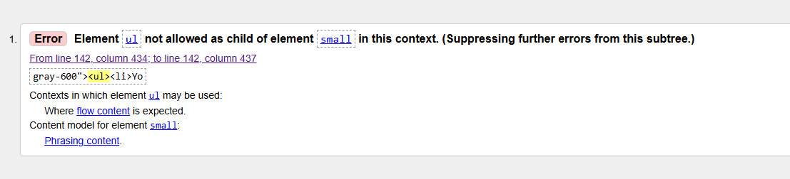

---

#### **The W3C CSS Validation Service**
The [W3C CSS Validator](https://jigsaw.w3.org/css-validator/) reports errors for @layer and @property. These are not actual mistakes -  they are rules that are part of modern CSS features: Cascade Layers (@layer) for organizing groups of CSS rules, and CSS Houdini (@property) for creating animatable, typed custom properties. Current W3C validation tools do not yet recognize these newer specifications, but all modern browsers support them.<br>

*There were no other warnings or errors - all clear.*

#### **The JSHint Validation Service**
I used [JSHint Validation Service](https://jshint.com/) to check my JavaScript files.

---
**script.js**<br>
*Passed with no errors.*

Initial errors related only to missing semi-colons, which has been rectified.

---

**gsap.js**<br>
*Passed with no errors.*

Initial errors related to missing semicolons and undefined variables for gsap, SplitText and ScrollTrigger, so added 
>/* global gsap, SplitText, ScrollTrigger */ 

at the top of the file to prevent the error, as the global variables are loaded via CDN.

---

#### **CI Python Linter**
I used the [Code Institute Python Linter](https://pep8ci.herokuapp.com/), along with the [VS Code autopep8 formatter](https://marketplace.visualstudio.com/items?itemName=ms-python.autopep8#:~:text=The%20autopep8%20extension%20for%20Visual,how%20to%20customize%20this%20extension.&text=Customize%20autopep8%3A%20You%20can%20customize,args%20setting.) to ensure that my python files met [PEP8](https://peps.python.org/pep-0008/) standards.
All initial checks came back with errors, such as trailing spaces and lines that were too long. The list below is for the final check of each file. I also added docstrings to the files both at the module-level, and for every class and method to ensure pep8 compliance.

---
* settings.py - *All clear, no errors found*
* urls.py - *All clear, no errors found*
---
* Nursery - models.py - *All clear, no errors found*
* Nursery - views.py - *All clear, no errors found*
* Nursery - urls.py - *All clear, no errors found*
* Nursery - tests.py - *All cleaar, no errors found*
* Nursery - forms.py - *All clear, no errors found*
* Nursery - apps.py - *All clear, no errors found*
* Nursery - admin.py - *All clear, no errors found*
---
* Garden - models.py - *All clear, no errors found*
* Garden - views.py - *All clear, no errors found*
* Garden - urls.py - *All clear, no errors found*
* Garden - tests.py - *All clear, no errors found*
* Garden - forms.py - *All clear, no errors found*
* Garden - apps.py - *All clear, no errors found*
* Garden - admin.py - *All clear, no errors found*
* Garden - signals.py - *All clear, no errors found*
* Garden - tailwind_field.py - *All clear, no errors found*
---
* Core - views.py - *All clear, no errors found*
* Core - models.py - No content
* Core - urls.py - *All clear, no errors found*
* Core - tests.py - No content
* Core - forms.py - No content
* Core - apps.py - *All clear, no errors found*
* Core - admin.py - No content

---

#### The WAVE Webb Accessibility Evaluation Tool
I used the [WAVE web accessibility evaluation tool](https://wave.webaim.org/) to check the accessibility of my pages and forms. Results and screenshots below.

* **index.html**<br>
0 errors  
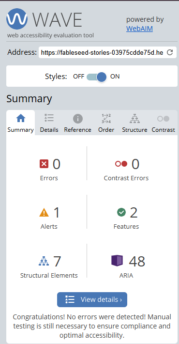

* **about.html**<br>
0 errors  
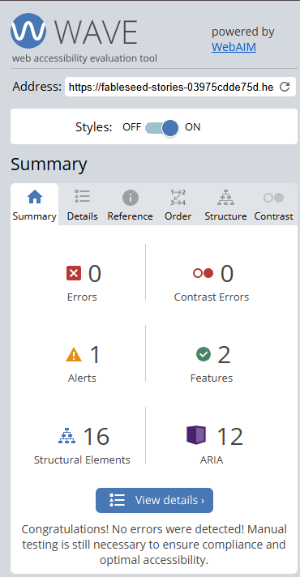

* **nursery.html**<br>
0 errors.  
1 initial error relating to an empty table header. Rectified this by adding a font awesome icon and marking it as aria-hidden=true  
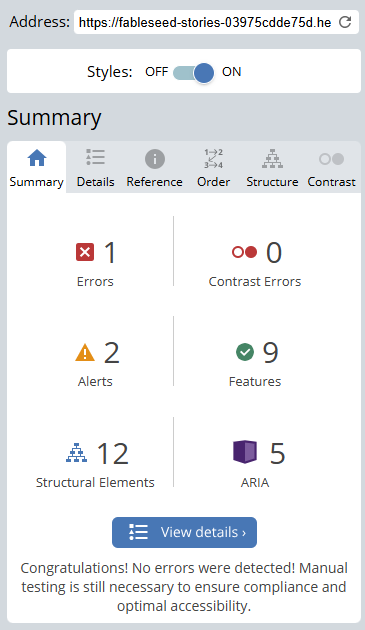 
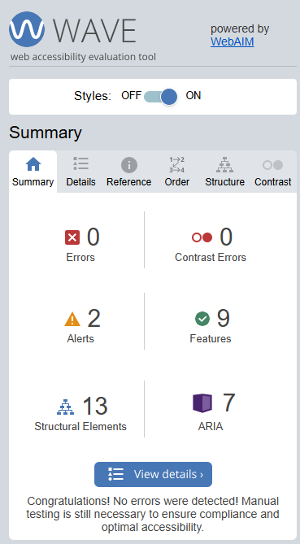

* **view-fableseed.html**<br>
0 errors  


* **cultivate.html**<br>
0 errors  
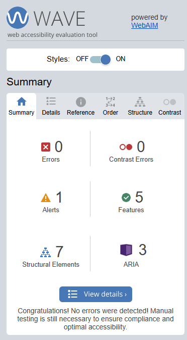

* **login.html**<br>
0 errors  
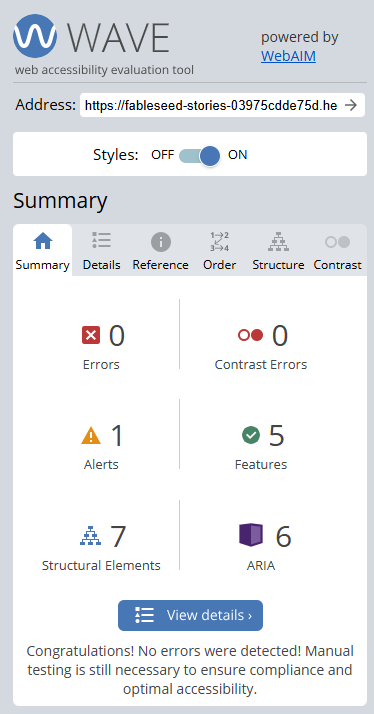

* **logout.html**<br>
0 errors  
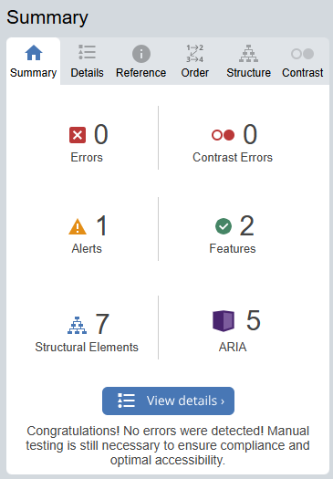

* **signup.html**<br>
0 errors  
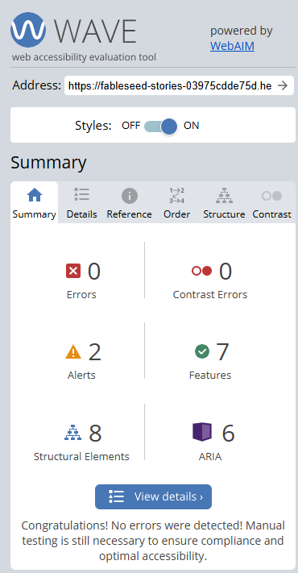

* **mygarden.html**<br>
0 errors  
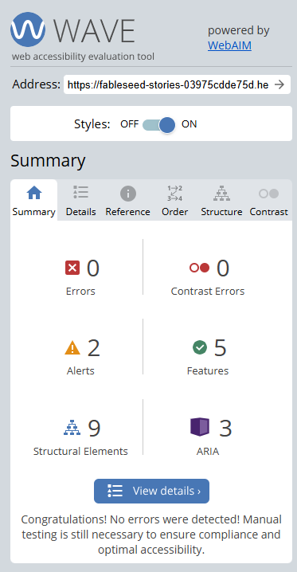

* **edit-profile.html**<br>
0 errors  
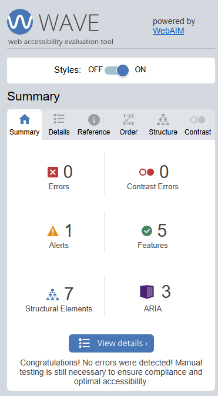

* **404.html**<br>
0 errors  
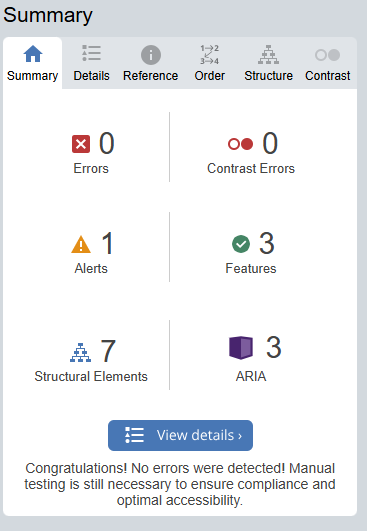

* **500.html**<br>
This page is a duplicate of 400.html

#### **Chrome Lighthouse**

**Index.html**

*Mobile Results*

Performance was at 80, so added STATICFILES_STORAGE = "whitenoise.storage.CompressedManifestStaticFilesStorage" to settings.py, as it serves compressed static files with caching
and, 'django.middleware.gzip.GZipMiddleware' to middleware in settings.py as it compresses responses like HTML, JSON and sometimes CSS/JS.
Best practice is on the low side due to cookies set by Cloudinary.

*Desktop Results*

Initial tests indicated that network despondency tree could be improved - created an extra css block on base.html and used that for font awesome on only the pages that use font awesome icons. I also added preconnect links for google fonts in the head of base.html, to let the fonts start downloading straightaway instead of waiting for the stylesheets to load. These measures improved desktop and mobile performance.
*Final results for both:*

Accessibility at 95 is due to the use of aria labelling by GSAP animation library. I have split paragraph text and aria shouldn't be applied to paragraphs.
Set the hero title and all the poem paragraphs to visibility: hidden and inserted lines into the JavaScript to make them visible again after the split was applie - this got the accessibility score to 100

---

**about.html**

*Mobile results*  
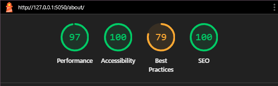

*Desktop results*  


---

**Nursery.html**

Performance and Best Practice low due to file format and size of plant images. Resized, changed format, replaced on cloudinary and the scores improved.

*Mobile results*  


*Desktop results*  
 


---

**view-fableseed.html**

Best practice score adversely impacted by the cloudinary cookies, which are abundant on this page due to the use of the placeholder imager that is stored on cloudinary and used for all profiles that haven't selected their own profile image.

*Mobile results*  


*Desktop results*  


---

**cultivate.html**

*Mobile results*  


*Desktop results*  


---

**login.html**

*Mobile results*  


*Desktop results*  


---

**logout.html**

*Mobile results*  


*Desktop results*  


---

**signup.html**

*Mobile results*  


*Desktop results*  


---

**mygarden.html**

*Mobile results*  


*Desktop results*  


---

**edit-profile.html**

*Mobile results*  


*Desktop results*  


---

**404.html**

*Mobile results*  


*Desktop results*  


---

Best Practice score was relatively low on all pages across mobile and desktop, worse on desktop than on mobile. This came directly from the fact that Cloudinary assets come from res.cloudinary.com, a 3rd party domain, and Chrome is phasing out third party cookies. My images load fine and give good performance, but I can't fix Cloudinary's cookie headers because its on their CDN configuration. I tried adding CLOUDINARY_STORAGE = {'SECURE': True,} to settings.py, but it didn't help in the slightest and adversely affected the performance of the pages, so I took it back out again. I double-checked my images by opening them up in a new tab to look at their urls, and they are being delivered securely by https and appear as 'Allowed" in the trust and safety section of Best Practice. I think for a future project I would look into an alternative image-hosting site which doesn't cause these best practice issues.


### *Manual Testing*
I tested my site on Chrome, Edge, FireFox and Safari. 
* **Chrome** <br>Mobile 320px. Tablet 768px. Laptop 1024px. Laptop L 1440px. 4k 2560px. 
    * All nav links work on all pages
    * All external links open in a new browser window
    * The layout reflows and changes as expected across different screen sizes
    * The background image appears and disappears as it should on different screen sizes
    * The logo text always links back to the home page from every other page
    * Hover colours work as expected on laptops and desktops
    * All required form fields have to be filled in
    * The burger icon expands and collapses the nav list as expected on mobile screens. If left open, it will disappear by itself when navigating to another page.
* **Edge** <br>Mobile 320px. Tablet 768px. Laptop 1024px. Laptop L 1440px. 4k 2560px. 
    * All nav and footer links work on all pages
    * All external links open in a new browser window
    * The layout reflows and changes as expected across different screen sizes
    * The background image appears and disappears as it should on different screen sizes
    * The logo text always links back to the home page from every other page
    * Hover colours work as expected on laptops and desktops
    * All required form fields have to be filled in
    * The burger icon expands and collapses the nav list as expected on mobile screens. If left open, it will disappear by itself when navigating to another page.
* **FireFox** <br>Mobile 320px. Tablet 768px. Laptop 1024px. Laptop L 1440px. 4k 2560px. 
    * All nav and footer links work on all pages
    * All external links open in a new browser window
    * The layout reflows and changes as expected across different screen sizes
    * The background image appears and disappears as it should on different screen sizes
    * The logo text always links back to the home page from every other page
    * Hover colours work as expected on laptops and desktops
    * All required form fields have to be filled in
    * The burger icon expands and collapses the nav list as expected on mobile screens. If left open, it will disappear by itself when navigating to another page.
* **Safari** <br> Tested on an iPhone SE 2023
    * The burger nav dropdown works as expected on all pages, expanding, collapsing and disappearing as it should
    * All nav links work on all pages
    * All external links open in a new browser window
    * All active nav-links display in the appropriate colour on the appropriate page
    * All required form fields have to be filled in
    * The logo text takes you back to the home page from every page

* Tested that Fableseeds create properly and display the right data from the user profile, the Fableseed model, and the Flower model
* Tested that Fableseeds can be edited and that the content changes on the screen correctly
* Tested that Fableseeds can be deleted, and the correct Fableseed has been deleted
* Tested that Fableseeds cannot be deleted if they have any branches associated with them
* Tested that Fablebranches create properly and display the correct data from the user profile and the Fablebranch model
* Tested that newly created Fablebranches attach to the correct Fableseed
* Tested that branching on a new flower for the first time creates a user flower record that displays an image and quantity on the user profile garden
* Tested that branching on subsequent seeds of the same flower type increments that flower type on the user's profile garden
* Tested that Fablebranches can be edited and that the content changes on the screen correctly
* Tested that Fablebranches can be deleted, and are removed from view
* Tested that when Fablebranches are deleted, the flower quantity on the user profile reduces by 1.
* Tested that when the original Fablebranch is deleted, the user flower is removed. Found out that if the original branch is deleted before subsequent branches, it removes the user flower despite the quantity being greater than 1 - [see interesting bugs section](#interesting-bugs)
* Tested that the correct flowers appear in the user's garden profile after branching on a fableseed
* Tested that the flower on the user profile links back to the original fableseed it was generated from
* Tested that the flower on the user profile links back to the original fableseed it was generated from, even if the branch that created the user flower record has been deleted/set to null
* Tested that users can edit their display name and bio, and that the information updates on submit
* Tested that users can update their profile pictures, and that the picture updates on submit and appears on Fableseeds and Fablebranches
* Tested that form validation works on the signup form and doesn't allow submission with empty fields
* Tested that the placeholder profile image displays immediately on a new user's profile garden
* Tested that Planting Fableseeds and Growing Fablebranches isn't available to logged-out users
* Tested that wherever it shows an author, it uses the display name instead of the username
* Tested that growing a new branch shoes a'Last Edited' date on the nursery table that matches the Fablebranch creation date
* Tested that removing all branches from a seed, removes the last edited date from the nursery table
* Tested that a really long word wouldn't break the Fablebranch article - it did, had to add a break class
* Tested that Fablebranch content doesn't break layout when the posts are very long. It did, it squished the profile area down to the smallest it could possibly be, so added an additional class to the article that keeps the profile area at a fixed size on medium and above screens.
* Tested that Fablebranches cannot br grown while Fableseeds aren't approved.


## **Technology used**
* [Adobe Color](https://color.adobe.com/)  
* [Adobe Firefly](https://www.adobe.com/uk/products/firefly.html)  
* [Adobe Photoshop](https://www.adobe.com/products/photoshop.html)  
* [Canva](https://www.canva.com/en_gb/)  
* [Cloudinary](https://cloudinary.com/)  
* [Crispy Forms](https://django-crispy-forms.readthedocs.io/)  
* [Daisy UI](https://daisyui.com/)  
* [DJ-database-url](https://pypi.org/project/dj-database-url/)  
* [Django](https://www.djangoproject.com/)  
* [Django allauth](https://docs.allauth.org/)  
* [Google Docs](https://docs.google.com/)  
* [Google Drive](https://drive.google.com/drive/quota)  
* [GSAP](https://gsap.com/)  
* [Gunicorn](https://gunicorn.org/)  
* [Javascript](https://www.w3schools.com/js/)  
* [Mermaid](https://mermaid.js.org/)  
* [Paint.NET](http://Paint.NET)  
* [Psycopg2](https://pypi.org/project/psycopg2/)  
* [Tailwind CSS](https://tailwindcss.com/)  
* [Whitenoise](https://whitenoise.readthedocs.io/en/stable/django.html)

## **Coding help**

* Verbose names for models in the admin site - [Django Model Admin Display](https://unfoldai.com/django-model-admin-display-name/#:~:text=Model%20instance%20display%20names,-The%20simplest%20way&text=When%20Django%20renders%20this%20model,see%20the%20actual%20country%20name.)  
* Help understanding returning Django model data to my website [Django model data display](https://medium.com/@justp1x3l/return-django-model-data-to-our-website-98d1e12b854d)  
* Help putting together unit tests [GeeksforGeeks Python unit test tutorial](http://geeksforgeeks.org/python/unit-testing-python-unittest/)  
* Help displaying images in admin model for flowers [dev.to](https://dev.to/vijaysoni007/how-to-show-images-of-the-model-in-django-admin-5hk4)  
* Help with Tailwind tables - [Materialtailwind.com](https://www.material-tailwind.com/docs/html/table)  
* Help with Tailwind media query classes - [StackOverflow](https://stackoverflow.com/questions/67446381/how-in-tailwindcss-table-hide-column-on-small-devices)  
* Help understanding how to make a page for individual fableseed posts after clicking on a link \- [mostlypython.com](https://www.mostlypython.com/django-from-first-principles-part-10/)  
* Help understanding how to extend the user model and connect it up when a new user is created [medium.com](https://medium.com/@karimdhrif4444/mastering-user-management-comprehensive-guide-to-extending-djangos-user-model-51c2ccd793d4)  
* Help creating a stacked inline user profile added to the base user model - [learndjango.com](https://learndjango.com/tutorials/django-userprofile-model)  
* Help with redirecting a user to another view on submission of a form - [geeksforgeeks](https://www.geeksforgeeks.org/python/django-redirects/)  
* Help with querying and getting parameters in a url - [djangocentral](https://djangocentral.com/capturing-query-parameters-of-requestget-in-django/)  
* Help on how to build a crispy forms helper layout to style form fields with tailwind classes - [BugBytes](https://www.youtube.com/watch?v=g-5tuE2d6JI)  
* Django login/logout tutorial - [learndjango.com](https://learndjango.com/tutorials/django-login-and-logout-tutorial)  
* Extending django allauth forms - [geeksforgeeks](https://www.geeksforgeeks.org/python/python-extending-and-customizing-django-allauth/)  
* Styling dt and dd tags in a description list, used on the mygarden page - [geeksforgeeks](https://www.geeksforgeeks.org/css/how-to-write-dt-and-dd-element-on-the-same-line-using-css/)  
* Help understanding how create functionality to edit profiles - [dev.to](https://dev.to/earthcomfy/django-update-user-profile-33ho)  
* Help understanding GSAP SplitText - [GSAP](https://gsap.com/docs/v3/Plugins/SplitText/)  
* Help styling the file input type - [Stack Overflow](https://stackoverflow.com/questions/572768/styling-an-input-type-file-button)  
* Website for generating a CSS glow effect, also generates Tailwind CSS classes - [notchtools.com](https://notchtools.com/css-glow-generator)  
* OKLCH colour picker for some of the Daisy UI theme colours - [oklch.com](https://oklch.com/#0.9612,0,0,100)
* Couldn't get profile area borders on fablebranch replies to alternate colours. ChatGPT helped me by suggesting an if statement: 
>  border-base-300  border-primary-content . 

This fix worked really well.


## **Interesting Bugs**

* I didn't realise that before you deploy to Heroku, you can extend the built-in User model to add extra fields. This is difficult to do after deploying to Heroku, which I'd already done. I ended up creating a separate user-profile model and learning about signals. The garden app has a signals.py file with a receiver decorator that runs a function every time a user is saved. It will only run when the built-in User model is saved. The function checks if the user has a userprofile and if not, creates a userprofile for them.


* Discovered that the crispy forms helper layout couldn’t or wouldn’t target the select dropdown box of database flowers. Ended up styling that myself in a custom.css file after trawling through crispy layout templates for far longer than necessary.  

* Crispy was styling my form fields in such a way that the text was barely visible. Found a file in the .venv Crispy Tailwind library called tailwind_field.py that allowed me to direcly customise the form field base styling. Big win, I thought - until I deployed to Heroku and it had reverted! Turned out I'd forgotten that the changes made in .venv to libraries and suchlike don't push through to github and therefore do not deploy to Heroku - Heroku installs the software anew. I had to create and initialise a templatetags folder and copy tailwind_field.py over so that the base_layout config I'd defined for the styling of crispy form fields was used once deployed on Heroku.
* Gitignore in .venv wasn’t hiding [env.py](http://env.py) - I had this setup from a codealong project from code institute. Added files to project level gitignore instead and ran git rm -r cached to stop git from tracking and then changed my env variables and secret key. Traces of the old database url and secret key and cloudinary url are in the commit history, but are no longer active or relevant.
* Profile images weren't updating when a user edited via the edit-profile form - needed enctype=multipart/form-data hard-coding on the template rather than through the form in [forms.py](http://forms.py)  
* Couldn’t figure out how to style the file input field on the edit profile form. Ended up with a mix of styling via the Crispy forms helper layout and styling input[type="file"] directly in custom.css to make the file picker look like a properly styled button.  
* Chrome Lighthouse performance score on index.html was poor on mobile and okay on desktop - it came back with lots of suggestions and errors I didn't understand. After using ChatGPT to help me understand what was going on, I made the following changes:
    * Added GZip middleware to settings.py for response compression
    * Added whitenoise compressed static storage config to serve compressed static files with caching. 
    * Removed font awesome link from base.html and replaced with an extra_css block, then served font awesome link only on pages that actually use it - about.html and nursery.html. 
    * Added preconnect links to google fonts in the head of base.html to allow the fonts to immediately load. 

All these measures massively improved google lighthouse performance on mobile and desktop

* GSAP animations weren't working on FireFox and the poem text was flickering briefly into view before disappearing completely, causing a layout shift that was jarring. I worked on this with ChatGPT by firstly setting all of the poem paragraphs and the hero title to visibility: hidden, then made the GSAP JS set it to visible again. I also set hero-content overflow to hidden. This stopped the flickering and the layout shift, which had been subtl on Chrome, but very noticeable on FireFox.
I then used requestAnimationFrame in the GSAP JS to wait for the browser to finish layout and painting, and prevent Firefox from miscalculating line positions. Animations now work in all browsers and no weird flickering or shifts occur. I was concerned that because the poem is hidden, if the JavaScript failed then the hero poem just wouldn't exist at all, so I created a block called extra_head and added page specific noscript fallback for the hero poem.

* When posting a branch on a Fableseed that relates to a flower the user doesn't have yet, it creates a userflower record. Subsequent branches of that flower type increase the quantity of that flower on the user flower record. When deleting branches, any aside from the original branch were decreasing the quantity as per the view, but deleting the original branch deleted the user flower record entirely, despite the user having a quantity of flowers greater than 1. I had to adjust the user flower model field earned_from_branch to set null on delete, and set null to true, then change my delete view to decrement the userflower quantity when a fablebranch is deleted, and delete the userflower record only if the quantity reaches 0. Less of a bug, more of a last-minute headache that has now been solved.
* UNSOLVED - WAVE error on signup form relating to flow content. Crispy forms styled the Allauth form for signup and an unordered list is inside a custom class called small. The unordered list is generated by a loop and a variable. Managed to track as far as finding the files, but can't locate where to change this unordered list and not even sure if I should, as it will mess with the formatting.

## **Deployment**

### Creating a Github Fork
1. Navigate to the [repository](https://github.com/Nexiauk/Gameracy).
2. In the top-right corner of the page click on the down arrow next to the **Fork** button and select **Create a new fork**.
3. You can change the name of the fork in **Repository name** and add an optional description.
4. Tick **Copy the main branch only**.
5. Click the **Create a Fork** button.
6. A new repository should appear in your GitHub with the name you chose.

### Cloning a Github Repository
1. Navigate to the [repository](https://github.com/Nexiauk/Gameracy).
2. Click on the **Code** button on top of the repository and copy the link.
3. Open Git Bash and change the working directory to the location where you want the cloned directory.
4. Type git clone and then paste the link.
5. Press Enter to create your local clone.

### Installing Requirements
1. Create a virtual environment in your local project folder.  
2. Activate the virtual environment.  
3. Install all required dependencies using the `requirements.txt` file using `pip install -r requirements.txt`  
4. Verify installation by running the project locally.  

### Preparing the Project
1. Ensure your Django project has a `requirements.txt` with all dependencies listed.  
2. Ensure your project has a `Procfile` at the root, specifying how Heroku should run the app.  
3. Make sure `ALLOWED_HOSTS` in `settings.py` includes your Heroku app domain.  
4. Ensure static files are configured for production (for example, using WhiteNoise).
5. Ensure `dj-database-url` is listed in `requirements.txt` so it is installed automatically.
6. Your `settings.py` should use `dj-database-url` to read the `DATABASE_URL` environment variable.  
  This ensures Django connects to the correct database in both local and Heroku environments.  
7. Set `DEBUG = False` in `settings.py` for production. 

### Creating an `env.py` File
1. In your local project directory, create a file named `env.py`.  
2. Add your sensitive environment variables to the file, for example:
   ```python
   import os

   os.environ['SECRET_KEY'] = 'your-secret-key'
   os.environ['CLOUDINARY_URL'] = 'your-cloudinary-url'
   os.environ['DATABASE_URL'] = 'your-local-database-url'
3. Ensure env.py is added to .gitignore so it is never pushed to GitHub


### Running Database Migrations and Collecting Static Files Locally
1. Check database migrations by executing `python manage.py makemigrations`.
2. Run database migrations locally to update the database schema by executing `python manage.py migrate`.
3. Collect static files locally so they are ready for deployment by executing `python manage.py collectstatic`.  
*Note: `DISABLE_COLLECTSTATIC=1` is needed to skip Heroku's automatic static collection when using Cloudinary.*

### Deploying Local Changes
1. Commit the changes using Git (`git add`, `git commit`).  
2. Push the changes to GitHub (`git push origin main`).  
3. Deploy the updated branch to Heroku using the steps in **Deploying on Heroku**.  

### Creating a Heroku App
1. Navigate to [Heroku](https://www.heroku.com/) and log in to your account.  
2. Click the **New** button in the top-right corner and select **Create new app**.  
3. Enter a unique name for your app.  
4. Select your preferred region.  
5. Click the **Create app** button to finalize the app creation.  
6. After the app is created, you will be taken to the app dashboard where you can configure settings and deploy your project.


### Configuring the App on Heroku
1. Navigate to the **Settings** tab of your app.  
2. Click **Reveal Config Vars**.  
3. Add the following variables:  
   - `CLOUDINARY_URL` → your Cloudinary account URL.  
   - `DISABLE_COLLECTSTATIC` → set to `1` if you want to skip automatic static collection.  
   - `DATABASE_URL` → automatically added if you enable Heroku Postgres (leave it as is).  
   - `SECRET_KEY` → your Django secret key.  
4. (Optional) Add any other third-party service keys your project needs

### Deploying on Heroku
1. Navigate to the **Deploy** tab of your Heroku app.  
2. Under **Deployment method**, select **GitHub**.  
3. Search for your GitHub repository and connect it.  
4. Under **Automatic deploys**, you can enable automatic deployment from the main branch if desired.  
5. Click **Deploy Branch** to deploy manually. 

### Verifying the Deployment
1. Click the **Open App** button in the top-right of the Heroku dashboard.  
2. Check that your Django project loads correctly in the browser.  
3. If any errors occur, click **More** → **View Logs** to troubleshoot.

### Optional Best Practices
- Keep all API keys and secrets in Config Vars, never in code.  
- Monitor logs regularly to catch any runtime errors.  
- Enable automatic deployment from GitHub for continuous updates.    


## **Credits**

### *Media*

* [Bas Meeuws \- Tulip \#17](https://www.the-low-countries.com/article/the-seventeenth-century-tulip-field-of-bas-meeuws/)  
* [Smokedsystem.com \- wildfire flowers](https://smokedsystem.com/which-flowers-often-appear-after-a-wildfire/)  
* [freepik.com \- plant growing from soil](https://www.freepik.com/free-ai-image/plant-growing-from-soil_268350286.htm)